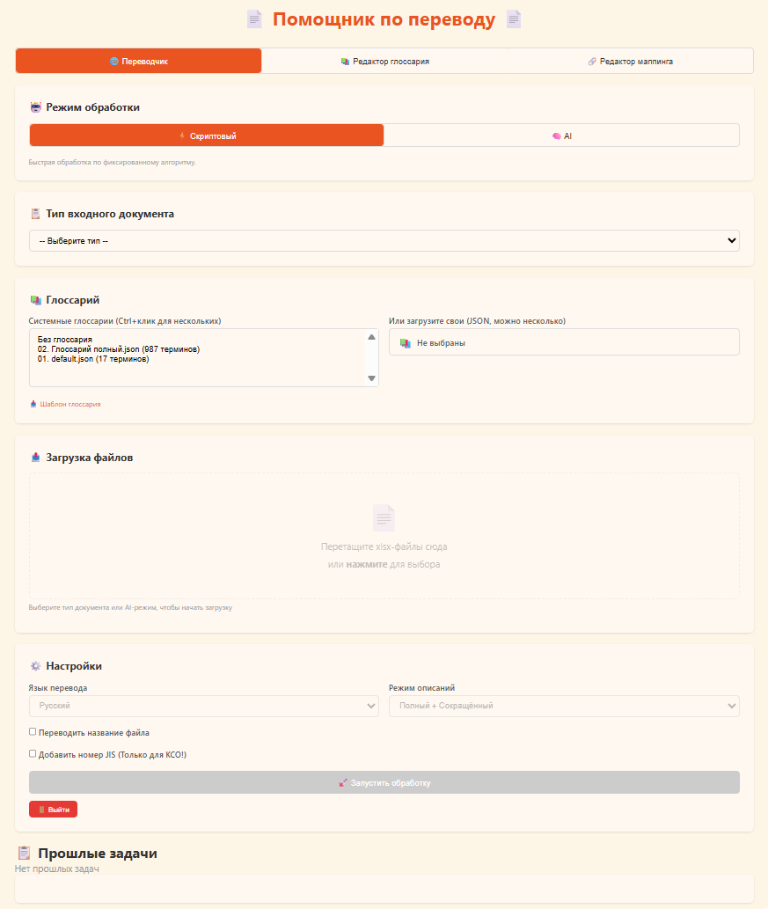
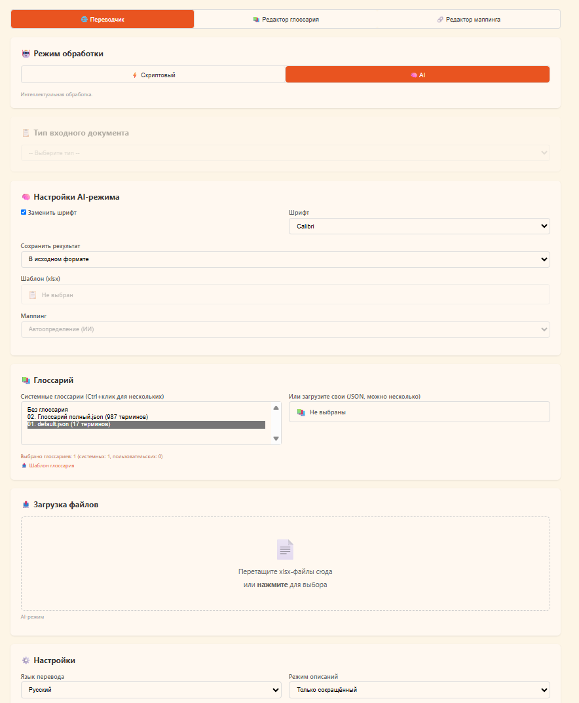
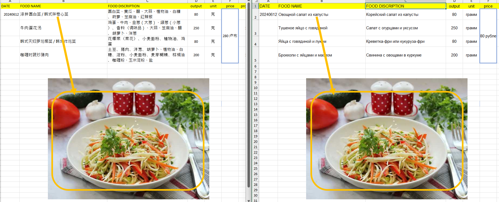
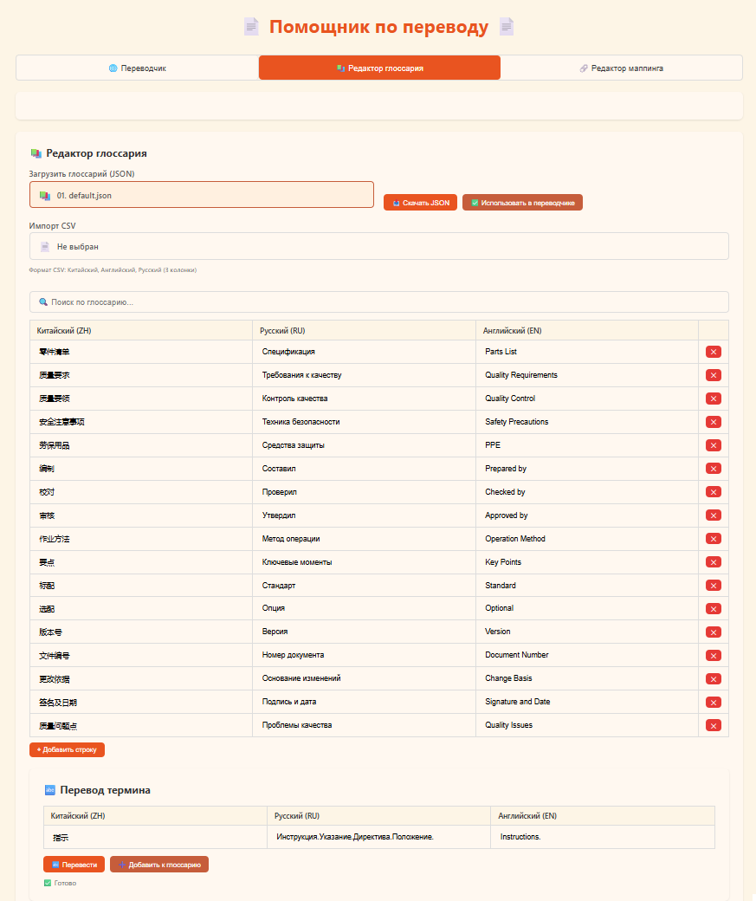
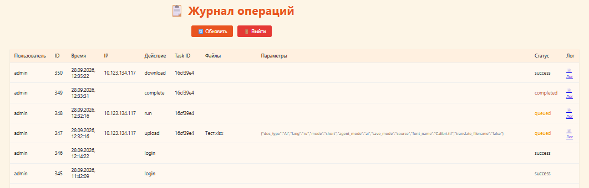

# XLSX_Translator
# Помощник по переводу

 

## О проекте

   
**Помощник по переводу** — система автоматического перевода иностранных XLSX файлов на русский и английский языки. Обрабатывает документы XLSX в двух режимах:  
 

- **Скриптовый режим** — фиксированный пайплайн из 5 шагов для стандартных типов документов. Переводит в российский шаблон.
- **AI-режим** — перевод любых XLSX с сохранением исходного форматирования, графики, shapes и стрелочек.  
  Система включает веб-интерфейс, редактор глоссария, редактор маппинга с собственным XLSX-вьювером, журнал аудита и FTP-доступ к результатам.

  

                                           <Общий вид вкладки «Переводчик»>

  

                      <Общий вид вкладки «Переводчик» с выбранным AI-режимом>



---

                                              <Результат работы AI-режима>

## Возможности

### Обработка документов

| Возможность                                      | Скриптовый |   AI-режим  |
|--------------------------------------------------|:----------:|:-------------:|
| Перевод в российский шаблон                      |     ✅  |       ✅ |
| Перевод в исходном формате                       |     —  |       ✅ |
| Структуризация через LLM                         |     ✅  |       — |
| Сокращение описаний                              |     ✅  |       ✅ |
| Сохранение графики (картинки, shapes, стрелочки) |     ✅  |       ✅ |
| Перевод надписей в shapes                        |     —  |       ✅ |
| Автоувеличение shapes под текст                  |     —  |       ✅ |
| Замена шрифта                                    |     —  |       ✅ |
| RAG-глоссарий                                    |     ✅  |       ✅ |
| DRAFT-подсказка для LLM                          |     ✅  |       ✅ |
| Многостраничная обработка                        |     ✅  | ✅ (все листы) |

 

### Веб-интерфейс

 

- Авторизация (роли `admin` и `user`)
- Drag-and-drop загрузка файлов
- Прогресс в реальном времени (SSE)
- Очередь задач
- История задач в браузере
- Скачивание результатов (один файл или ZIP)  
   

### Глоссарий

 

- Редактор глоссария (таблица ZH/RU/EN)
- Поиск по глоссарию
- Импорт CSV (Китайский, Английский, Русский)
- Перевод отдельных терминов через TranslateGemma
- Экспорт в JSON
- Использование нескольких системных + пользовательских глоссариев  
   

  

        <Вкладка «Редактор глоссария» с загруженным глоссарием и полем поиска>  
   

### Редактор маппинга

- Два независимых окна XLSXViewer (исходник и шаблон)
- Собственный XLSX-вьювер на базе OfficeCLI
- Выбор ячеек: клик, Ctrl+клик, Shift+диапазон, протягивание
- Режимы выбора: ячейка / строка / колонка / диапазон
- Кнопка «Закрепить привязку» для отправки выделения в редактор
- Таблица привязок (редактор по аналогии с глоссарием)
- Загрузка сохранённого маппинга из JSON
- Создание маппинга через LLM по описаниям структур  
   

  

    <Вкладка «Редактор маппинга» с XLSXViewer и анализом структуры>  
   

### Журнал операций

 

- Доступен только `admin` по адресу `/audit-page`
- Записи: пользователь, IP, время, действие, task_id, файлы, статус
- Скачивание лога выполнения каждой задачи  
   

  

                               <Страница /audit-page с таблицей событий -->

---

## Архитектура

```
┌──────────────────────────────────────────────────────────┐  
│                   Веб-интерфейс (HTML/JS)                │  
│  index.html • auth.js • translator.js • glossary.js      │  
│  mapping.js • audit.html • audit.js                      │  
│  xlsx-viewer.html • xlsx-viewer.js                       │  
└────────────────────────┬─────────────────────────────────┘  
                         │ HTTP / SSE  
┌────────────────────────▼─────────────────────────────────┐  
│         FastAPI сервер (agents/agent.py, порт 8000)      │  
│  • Авторизация  • Очередь задач  • SSE-прогресс          │  
│  • /upload, /run, /events, /download, /audit             │  
│  • /api/render-xlsx, /api/xlsx-viewer-data               │  
│  • /api/save-mapping, /api/generate-mapping-from-text    │  
└──┬───────────────────────────────────────────┬───────────┘  
   │ script mode                               │ ai mode  
   │                                           │  
┌──▼──────────────────────────┐  ┌─────────────▼───────────┐  
│  Пайплайн               │  │  ai_agent.py            │  
│  scripts/                   │  │  • Перевод батчами      │  
│  01. parser → SQLite        │  │  • Копирование графики  │  
│  02. structure (LLM)        │  │  • Перевод shapes       │  
│  03. translate (LLM)        │  │  • Замена шрифтов       │  
│  04. summarize (LLM)        │  │  • JIS в имени файла    │  
│  05. build → шаблон         │  │  • Работа с маппингом   │  
└──┬──────────────────────────┘  └──────────┬──────────────┘  
   │                                        │  
   └────────────────┬───────────────────────┘  
                    │  
      ┌─────────────▼──────────────┐  
      │  Инференс                  │  
      │  • llama.cpp (Qwen3-14B)   │ ← GPU  
      │  • Ollama CPU (embed)      │ ← CPU  
      │  • TranslateGemma 12B      │ ← CPU  
      └────────────────────────────┘  
```

 

### Инфраструктура

 

| Компонент        | Назначение                                                     | Порт                      |
|------------------|----------------------------------------------------------------|---------------------------|
| **llama.cpp**    | Qwen3-14B Q4_K_M для перевода, структуризации, сокращения      | 8080                      |
| **Ollama (CPU)** | nomic-embed-text (векторизация) + translategemma:12b (термины) | 11434                     |
| **FastAPI**      | Основной сервер                                                | 8000 (prod) / 8001 (test) |
| **nginx**        | Проксирование + большие файлы                                  | 8888                      |
| **FTP-сервер**   | Read-only доступ к `output/` для админа                        | 2121                      |

---

## Использование OfficeCLI

**OfficeCLI** — внешний инструмент для работы с офисными файлами (DOCX, XLSX, PPTX) через командную строку. В проекте используется для **чтения структуры XLSX** — извлечения ячеек, shapes, изображений и связей между ними.  
 

### Зачем

Openpyxl **не может корректно** извлекать shapes, стрелочки и графику из сложных XLSX. OfficeCLI даёт структурированный JSON со всей графикой и координатами.  
 

### Где используется

**Собственный XLSXViewer** — эндпоинт `/api/xlsx-viewer-data` (в `agent.py`) читает XLSX через OfficeCLI и возвращает JSON для вьювера:

- **Ячейки** — `officecli get /Sheet --depth 3 --json`
- **Shapes** — `officecli raw /Sheet/drawing --json`
- **Медиа** — извлекаются из ZIP и кодируются в base64
- **Rels** — связи между `drawing.xml` и медиафайлами
- **Мерженные ячейки** — парсинг через regex
- **Ширины колонок, высоты строк** — из `sheetFormatPr`  
   

### Установка OfficeCLI

 

```bash
# Linux/macOS  
curl -fsSL https://raw.githubusercontent.com/iOfficeAI/OfficeCLI/main/install.sh | bash  
   
# Или npm  
npm install -g @officecli/officecli  
```

**Путь по умолчанию:** `~/.local/bin/officecli`  
   
**Проверка:**

```bash
officecli --version  
```

### Команды, используемые в проекте

 

```bash
# Структура листов  
officecli get file.xlsx / --depth 1 --json  
   
# Ячейки листа  
officecli get file.xlsx /Sheet1 --depth 3 --json  
   
# Shapes  
officecli query file.xlsx "shape" --json  
   
# Raw XML (для разбора drawing XML)  
officecli raw file.xlsx /Sheet1/drawing --json  
   
# HTML-рендер (альтернативный предпросмотр)  
officecli view file.xlsx html -o output.html  
```

### Ограничения

 

- **Не переносит графику между файлами.** Копирование shapes/images реализовано вручную через zipfile в `copy_graphics()` (в `ai_agent.py`).
- **HTML-рендер** OfficeCLI не используется из-за некорректного отображения файлов. Основной предпросмотр — собственный XLSXViewer.  
   

### Ссылки

- GitHub: [iOfficeAI/OfficeCLI](https://github.com/iOfficeAI/OfficeCLI)
- Сайт: [officecli.ai](https://officecli.ai)  
   

---

 

## Собственный XLSXViewer

   
Собственный вьювер XLSX — основа редактора маппинга. Написан на чистом JavaScript, работает в отдельном окне, открывается из редактора маппинга.  
 

### Точность отображения

Вьювер показывает XLSX с **точностью 85–90%** от оригинального Excel:  
 

- ✅ Ячейки с текстом, форматированием, стилями
- ✅ Мерженные диапазоны (colspan/rowspan)
- ✅ Изображения (из `xl/media/`, base64)
- ✅ Shapes: прямоугольники, эллипсы, стрелки, скруглённые прямоугольники
- ✅ Эллипсы-оверлеи на изображениях (жёлтая обводка)
- ✅ Ширины колонок, высоты строк
- ✅ Выравнивание, шрифты, цвета, границы
- ✅ Многострочный текст (`wrapText`)
- ✅ Множественные листы (селектор)  
   

### Возможности

 

- **Множественные листы** — селектор листов
- **Выбор ячеек:**  
    - Клик — 1 ячейка  
    - Ctrl+клик — мультивыбор  
    - Shift+клик — диапазон  
    - Протягивание — область
- **Режимы выбора:** ячейка / строка / колонка / диапазон
- **Кнопка «Закрепить привязку»** — отправляет выбранные ячейки в родительское окно через `postMessage`
- **Sticky-заголовки** — заголовки строк и колонок остаются на месте при прокрутке
- **Адаптивные размеры** — все размеры в pt, соответствуют оригинальному Excel  
   

### Файлы

 

| Файл                      | Назначение                                  |
|---------------------------|---------------------------------------------|
| `web/xlsx-viewer.html`    | HTML-обёртка, тулбар, контейнер для таблицы |
| `web/js/xlsx-viewer.js`   | Логика вьювера (класс `XLSXViewer`)         |
| `web/css/xlsx-viewer.css` | Стили таблицы, оверлеев, заголовков         |

 

### Как это работает

 

1. Редактор маппинга (`mapping.js`) открывает окно `/web/xlsx-viewer.html` через `window.open` с уникальным именем (`viewer_source` / `viewer_template`)
2. Через `postMessage` передаёт файл и сторону (`source` / `template`)
3. Вьювер читает файл через `/api/xlsx-viewer-data` и рендерит таблицу
4. Пользователь выбирает ячейки и нажимает «Закрепить привязку»
5. Вьювер отправляет `postMessage` обратно в родительское окно
6. Родитель (`mapping.js`) сохраняет выбор в `sourceSelected` / `templateSelected`
7. Кнопка «Привязать выделенное» создаёт новую привязку в таблице  
    

### Схема взаимодействия

 

```
Редактор маппинга (mapping.js)  
    │  
    │ window.open + postMessage({type: 'load-file', file, side})  
    ▼  
XLSXViewer (xlsx-viewer.js)  
    │  
    │ fetch('/api/xlsx-viewer-data')  
    ▼  
FastAPI → OfficeCLI → JSON  
    │  
    │ рендер таблицы, выбор ячеек  
    │  
    │ postMessage({type: 'binding-selected', side, cells})  
    ▼  
Редактор маппинга (mapping.js)  
    │  
    │ sourceSelected / templateSelected  
    ▼  
Таблица привязок  
```

 

### Особенности реализации

   
**Рендер таблицы:**

- **Заголовки строк и колонок** — sticky, при прокрутке остаются на месте
- **Мерженные ячейки** — реализованы через `colspan` и `rowspan`, занятые ячейки пропускаются
- **Overlay для графики** — отдельный `<div class="graphics-overlay">` с абсолютным позиционированием
- **Стрелки** — рисуются как `<line>` + `<polygon>` с пересчётом из EMU в проценты (деление на 12700)
- **Эллипсы-оверлеи** — накладываются на изображения по координатам из OOXML
- **Размеры** — все в pt (1 pt = 1.333 px в CSS)
- **Изображения** — вставляются как `` с base64, `object-fit: contain`  
     
  **Обработка shapes:**
- Прямоугольники, скруглённые прямоугольники, эллипсы
- Стрелки (`straightConnector1`) с учётом `flipH`/`flipV`
- Треугольники, стрелки направлений (rightArrow, leftArrow, upArrow, downArrow)
- Текстовые надписи поверх shapes  
     
   

---

 

## Установка

 

### Требования

 

- Linux (Mint/Ubuntu)
- Python 3.12
- NVIDIA GPU (10GB VRAM минимум)
- 32 GB RAM
- NVIDIA драйверы + CUDA  
   

### Шаги

   
**1. Клонирование и виртуальное окружение:**

```bash
cd ~/master_agent  
python3 -m venv venv  
venv/bin/pip install -r requirements.txt  
```

   
**2. Зависимости:**

```bash
# llama.cpp — собрать из исходников или установить бинарник  
   
# Ollama  
curl -fsSL https://ollama.com/install.sh | sh  
ollama pull nomic-embed-text  
ollama pull translategemma:12b  
   
# OfficeCLI  
curl -fsSL https://raw.githubusercontent.com/iOfficeAI/OfficeCLI/main/install.sh | bash  
```

   
**3. Модели:**

```bash
# Qwen3-14B Q4_K_M в /opt/llama.cpp/models/  
```

   
**4. Пользователи:**

```bash
python3 create_user.py --create --username admin --password secret --role admin  
```

   
**5. Шрифты:**

```bash
mkdir fonts  
# Положить Arial.ttf, Calibri.ttf, Times_New_Roman.ttf  
```

   
**6. systemd-сервисы:**

```bash
sudo cp systemd/*.service /etc/systemd/system/  
sudo systemctl daemon-reload  
sudo systemctl enable --now llama-server kso-agent kso-ftp ollama-cpu  
```

   
**7. nginx:**

```bash
sudo cp nginx/kso-agent /etc/nginx/sites-enabled/  
sudo nginx -t && sudo systemctl reload nginx  
```

##  

 

## Структура проекта

 

```
master_agent/  
├── agents/  
│   ├── agent.py           # FastAPI-сервер  
│   └── ai_agent.py        # AI-режим  
├── scripts/  
│   ├── type1/                # Пайплайн закрытый 1  
│   ├── type2/                # Пайплайн закрытый 2  
│   ├── disabled/          # Заглушка  
│   ├── pipelines.json     # Описание пайплайнов  
│   └── doc_types.json     # Типы документов  
├── web/  
│   ├── index.html         # Главный интерфейс  
│   ├── audit.html         # Журнал операций  
│   ├── xlsx-viewer.html   # Собственный XLSX-вьювер  
│   ├── css/               # Стили  
│   └── js/                # Скрипты интерфейса  
├── glossaries/            # Глоссарии JSON  
├── mappings/              # Маппинги JSON  
├── templates/             # Шаблоны XLSX  
├── fonts/                 # Шрифты TTF  
├── profiles/              # Профили документов  
├── uploads/               # Загруженные файлы (по task_id)  
├── output/                # Результаты (по task_id)  
├── profiles.py            # Система профилей  
├── create_user.py         # Управление пользователями  
├── ftp_server.py          # FTP-сервер  
└── README.md  
```

##  Использование

 

### Скриптовый режим

 

1. Выбрать режим «⚡ Скриптовый»
2. Выбрать тип документа type1 или type2 (заблокировано)
3. Настроить язык (RU/EN), режим (full/short)
4. Выбрать глоссарий (Ctrl+клик для нескольких)
5. Загрузить XLSX-файлы
6. Нажать «🚀 Запустить обработку»  
      
   **Результат:** файл в русском шаблоне + сокращённая версия.  
    

### AI-режим

 

1. Выбрать режим «🧠 AI»
2. Настроить:  
      - Сохранить результат (в исходном формате / в шаблоне)  
      - Шаблон (если выбран)  
      - Маппинг (если выбран)  
      - Шрифт (опционально)  
      - Галки: «Переводить название файла», «Добавить код файла»
3. Выбрать глоссарий
4. Загрузить XLSX-файлы
5. Нажать «🚀 Запустить обработку»  
      
   **Результат:** переведённый XLSX с сохранением графики.  
    

### Редактор маппинга

 

1. Загрузить исходный файл и шаблон
2. Нажать «🔍 Построить структуру документа» для обоих
3. Нажать «🤖 Построить маппинг» — LLM сгенерирует привязки
4. Или:  
      - Нажать «📊 Исходник» и «📋 Шаблон» — откроются окна XLSXViewer  
      - Выбрать ячейки в каждом окне  
      - Нажать «📌 Закрепить привязку» в каждом  
      - Нажать «🔗 Привязать выделенное» в редакторе
5. Проверить/поправить привязки в таблице
6. Нажать «💾 Сохранить JSON» или «✅ Использовать в переводчике»  
    

### Журнал операций

   
Открыть `/audit-page`, войти как `admin`. Просмотр событий, скачивание логов выполнения.  
 

### FTP

   
Подключиться к `ftp://<your_ip>:2121/` через WinSCP/FileZilla. Логин/пароль от веб-интерфейса (только admin).  
 

## Лицензия

## Внутренний проект. Коммерческое использование — недопустимо.
